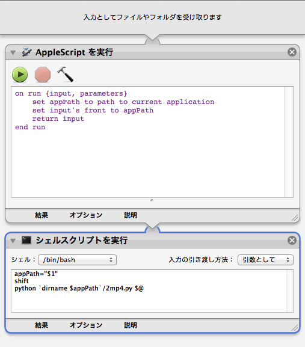

2mp4
====

日々の動画ファイル変換を支援するスクリプト。

## Description
ffmpeg用のラッパーです。
## Demo

## VS. 

## Requirement
- ffmpeg & ffprobe のバイナリが必要です。  
[こちらで入手](https://www.ffmpeg.org/download.html)

## Usage
- 実行ファイルをダブルクリックで設定画面が開きます。
- videoファイルや連番入りフォルダをdropで実行します。  
- windowsの コンテキストメニュー > 送る とかに入れとくと、すごく良いです。

## Install

- for Windows
    * cx_Freezeで実行ファイル化してください  
```python setup.py build ```

- for osX
    * automatorで実行してください。  


- 初回起動時にffmpeg,ffprobeのパスを通す必要があります。  
設定画面で指定してください。

## Contribution

## Licence
MIT

## Author
[sweetberry](https://github.com/sweetberry)